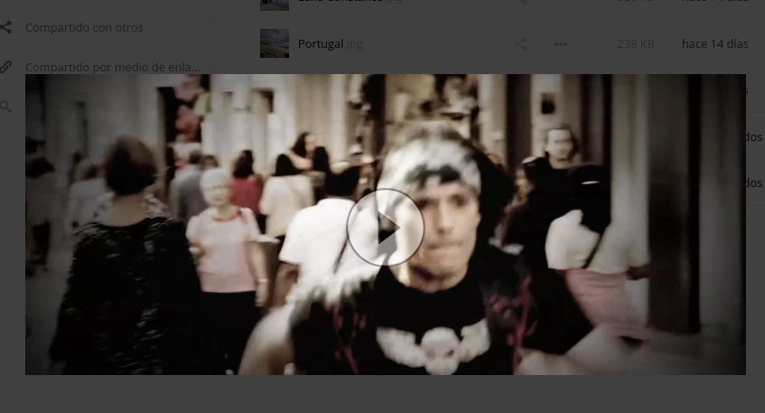
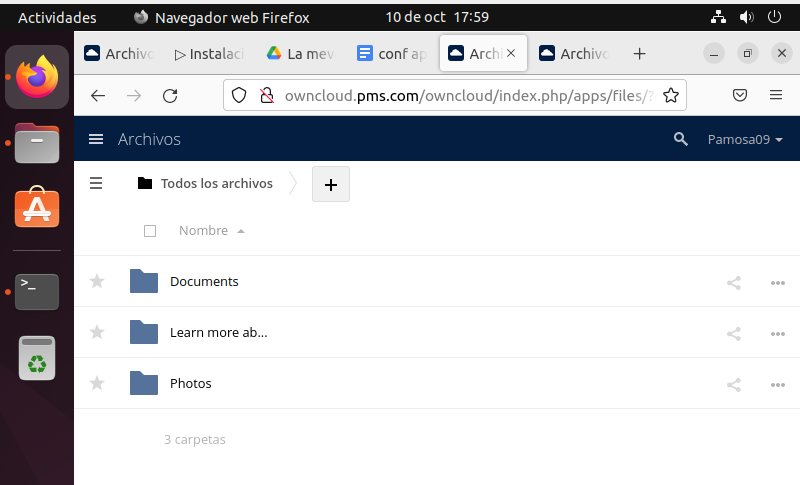
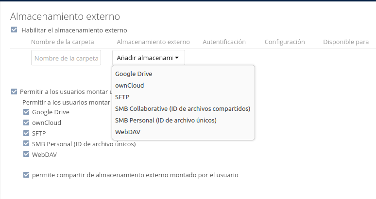
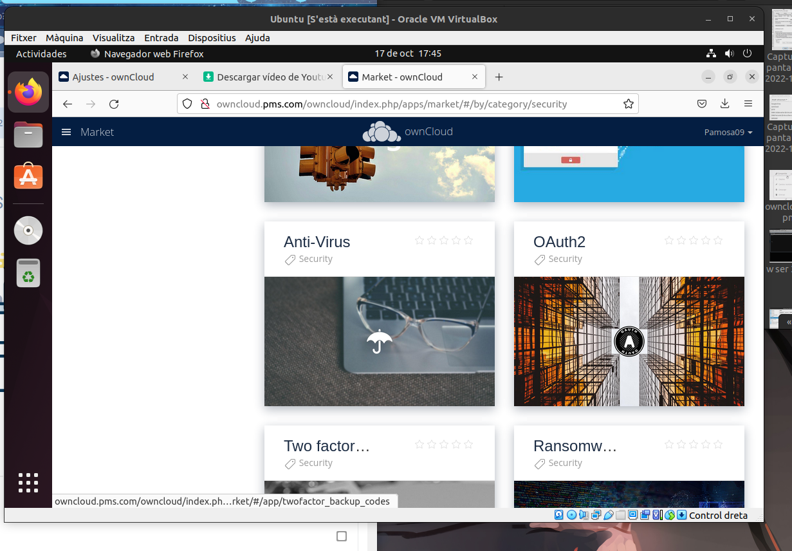
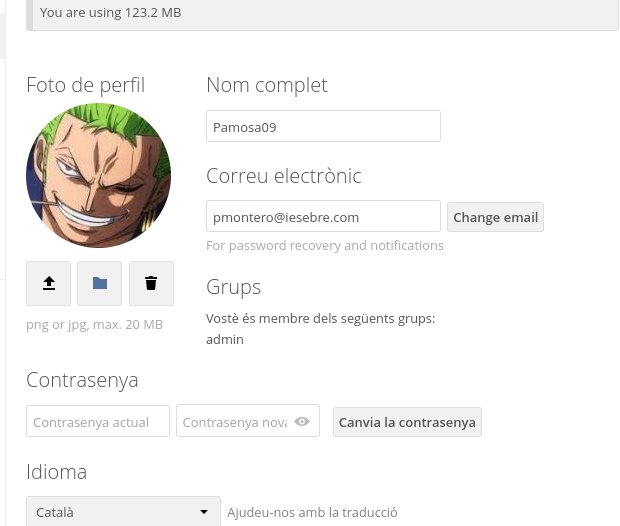

**3.2.** A Owncloud podem veure que hi ha una serie de carpetes per defecte, mostra la ruta real a les tres carpetes dins de la teva MV.

**3.3.**

- Quin són els tres tipus de protecció de dades que ofereix Owncloud?

    Te 3 pasos a l'hora de  encriptar.

       - Encriptacio en trànsit.
       - Xifratge en repòs amb clau mestra al mòdul de seguretat de maquinari.
       - Xifratfe d'extren a extrem.
- Fes una petita descripció de cada un d'ells.
    - Encriptacio en trànsit:
      El cifrado en tránsito proporciona una manera de proteger los datos entre instancias y sistemas de archivos          mediante el cifrado TLS v. 1.2 (seguridad de capa de transporte).
      
  
  
 - Xifratfe en repos:
    - El cifrado en reposo está diseñado para evitar que el atacante obtenga acceso a los datos sin cifrar asegurándose de que los datos se cifran en el disco. Si un atacante obtiene una unidad de disco duro con datos cifrados pero no las claves de cifrado, el atacante debe anular el cifrado para leer los datos.
      
- Xifratge de extrem a extrem:
    - El xifratge extrem a extrem (E2EE) garanteix que les vostres dades es xifren (es mantenen en secret) fins que arriben al destinatari previst. Tant si esteu parlant de missatgeria xifrada de punta a punta, correu electrònic, emmagatzematge de fitxers o qualsevol altra cosa, això garanteix que ningú del centre pugui veure les vostres dades privades.

- Per quina raó ens recomana utilitzar Owncloud per als documents de Microsoft Office de la nostra empresa?
  
 **Protecció de fitxers a cada pas:**
 
 
A més d'aquests xifratge complet
mesures, ownCloud té un conjunt de funcions per augmentar la protecció de dades i el secret
fitxers, és a dir, Cicle de vida dels fitxers, Bloqueig de fitxers o Classificació de documents. L'aplicació de gestió del cicle de vida dels fitxers arxiva i conserva els fitxers en funció de la data de càrrega. Basat en determinades regles, fitxers que només s'utilitzen per
es pot esborrar un cert període de temps
o arxivat automàticament, si hi ha dades crítiques. A canvi, els fitxers es poden conservar més temps si cal. El connector File Firewall comprova cada sol·licitud d'accés amb una llista de
regles i polítiques, protecció contra l'accés
mitjançant usuaris fora de les oficines corporatives i o fins i tot desactivant l'accés des de països d'alt risc.
Protecció de fitxers a cada pas
A més d'aquests xifratge complet
mesures, ownCloud té un conjunt de funcions per augmentar la protecció de dades i el secret
fitxers, és a dir, Cicle de vida dels fitxers, Bloqueig de fitxers o Classificació de documents. L'aplicació de gestió del cicle de vida dels fitxers arxiva i conserva els fitxers en funció de la data de càrrega. Basat en determinades regles, fitxers que només s'utilitzen per
es pot esborrar un cert període de temps
o arxivat automàticament, si hi ha dades crítiques. A canvi, els fitxers es poden conservar més temps si cal. El connector File Firewall comprova cada sol·licitud d'accés amb una llista de
regles i polítiques, protecció contra l'accés
mitjançant usuaris fora de les oficines corporatives i o fins i tot desactivant l'accés des de països d'alt risc.

- Això passa a tots els països?

SI

- Quina és la llicència d'OWncloud Enterprise?

ownCloud Commercial License

- I la d'Owncloud Standard?

AGPLv3

- Es poden veure videos en Streaming directament des de Owncloud?

- Es poden connectar directoris de Google Drive a Owncloud?

- I Dropbox?

- Compta Owncloud amb antivirus? En cas afirmatiu com es diu?

** 3.4.- Mostra els següents canvis de paràmetres d'usuari:

Posa't una imatge d'usuari.
Afegeix el teu mail de l'Institut.
Canvia l'idioma a català.
Mostra la versió d'Owncloud instal·lada.

