# Instal·lació Owncloud

1. Hem de instalar apache:

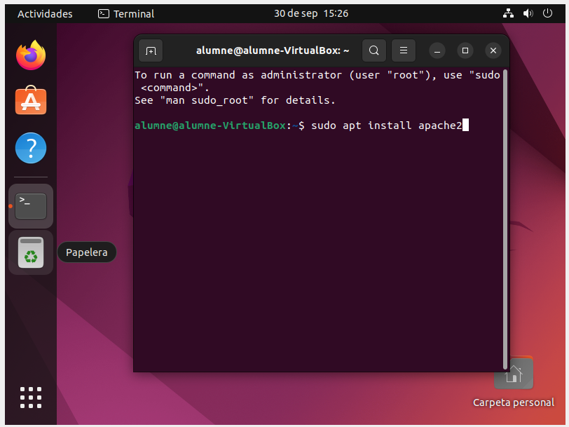

2. Desactivem el llistat de directoris del servidor:

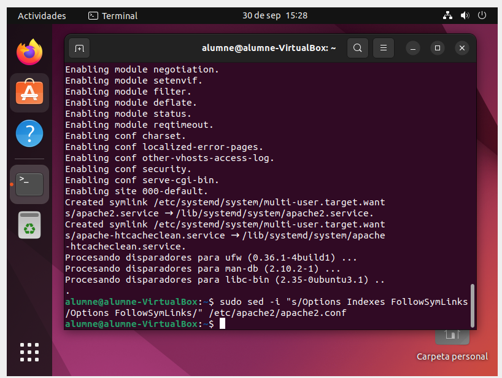

3. Hem de instalar MariaDB

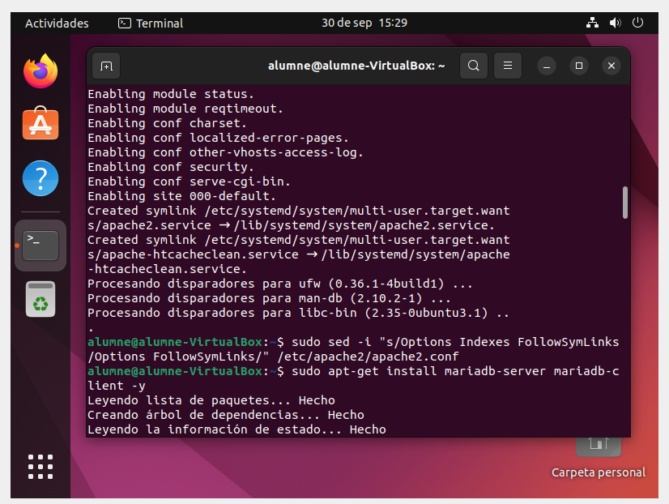

I configurem la instal·lació:
   
Aquí és interessant:

* Deshabilitar usuaris anònims.
* Desactivar accés remot com a root.
* Eliminar les bases de dades de testeig i accedir-hi.
* Actualitzar les taules de privilegis.

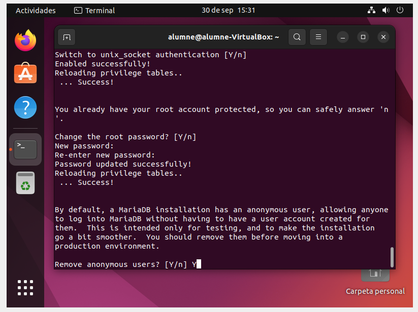

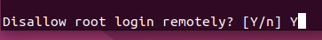

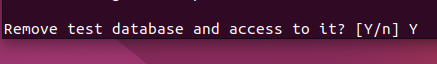

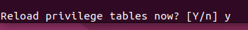

Finalment reiniciem el servidor MariaDB.

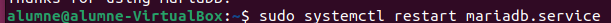

Crear la base de dades d'owncloud:

Entrem a MariaDB:

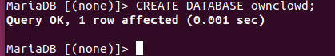

Creem un usuari anomenat ownclouduser amb una contrasenya que podria ser Admin1234.

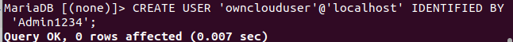

li donem accés a l'usuari a la base de dades creada:

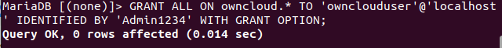

Apliquem els canvis i sortim:

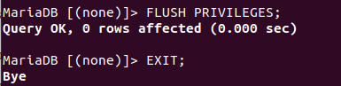

Instal·lar PHP i els seus mòduls necessaris:

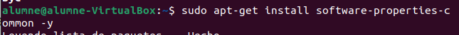

Hem de tenir en compte els requisits d'Owncloud abans d'instal·lar els mòduls.

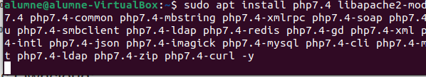

Després de la instal·lació editem el fitxer php.ini i canviarem alguns valors:

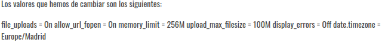

Instal·lem Owncloud:

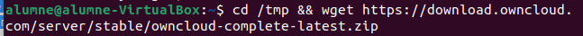

Canviem propietari i permisos dels directoris d'owncloud. www-data perquè els pugui fer servir Apache, 755 perquè els pugui executar i llegir qualsevol usuari de Linux:

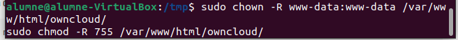

Configurar Apache:

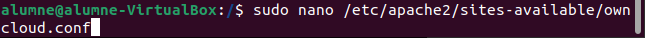

Hem de deixar un fitxer com el següent, però canviant el ServerName i el ServerAlias ​​pels noms i àlies del nostre propi domini.

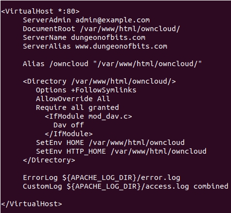

Habilitem owncloud i el mòdul rewrite:

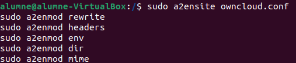

Reiniciem Apache:

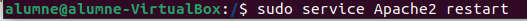

** Explicació de les linies del fitxer Owmcloud.conf:

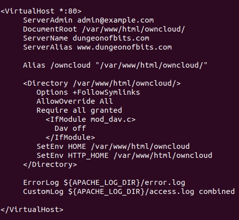

1r adresa web del admin 2 on volem que aparegui la gent que entra al servei 3 Nom del servidor
